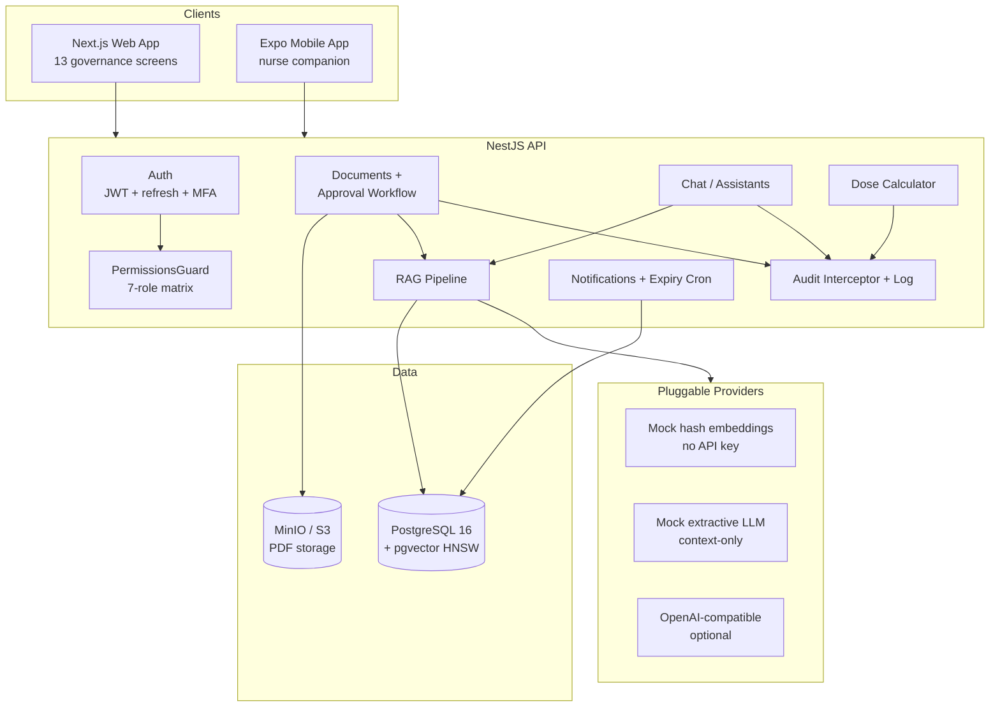
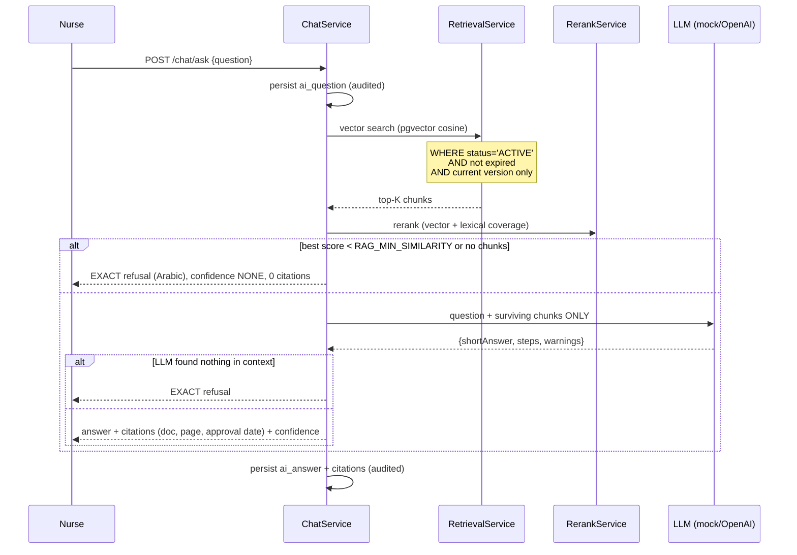
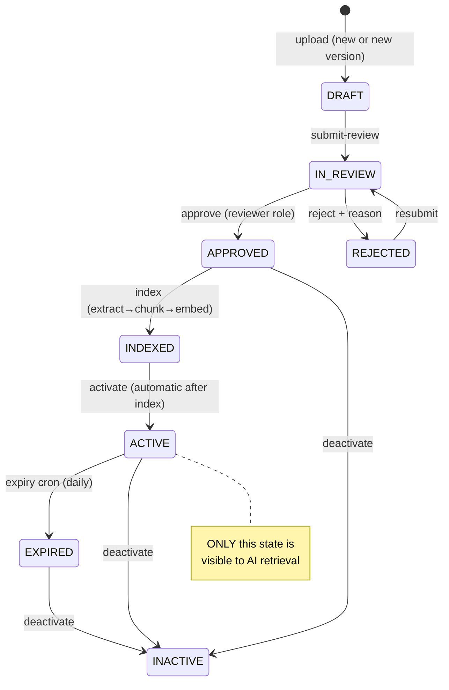

# Architecture

## System overview

## RAG query flow (refusal-first)

## Document lifecycle

## Key design decisions

| Decision | Rationale |
| --- | --- |
| Refusal enforced **server-side, before and after** the LLM | The model can never be prompted into answering without sources |
| Mock LLM is extractive | Zero-hallucination baseline; system runs without any API key |
| Chunks never cross page boundaries | Page-accurate citations |
| Chunks tied to `documents.version_number` | New versions must be re-approved and re-indexed before retrieval |
| Permission matrix in `packages/shared` | One source of truth for API guard, web nav and seeds |
| Global audit interceptor + domain events | Coarse HTTP trail plus semantic events (refusals, approvals, downloads) |
