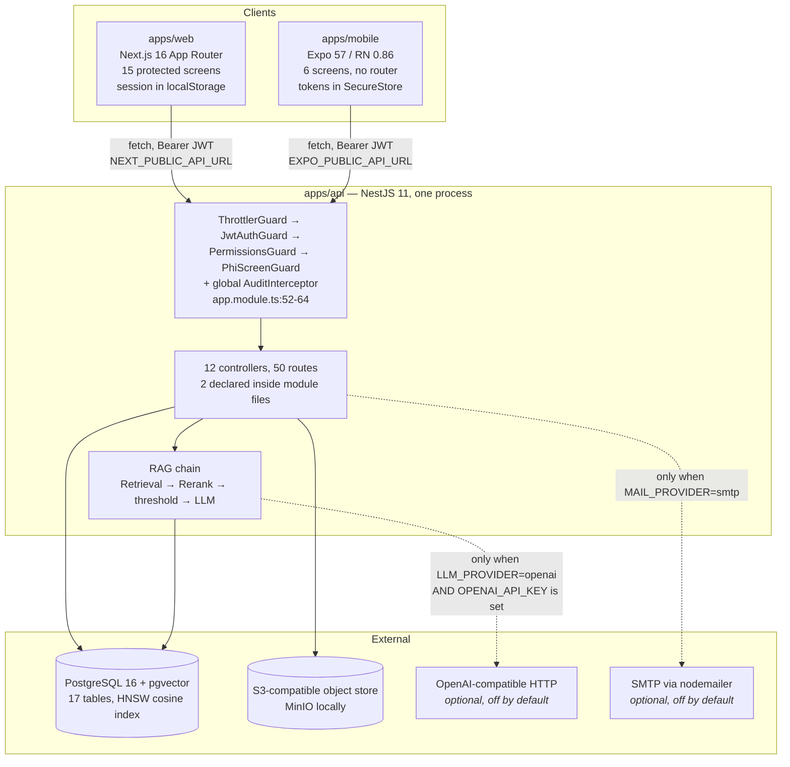
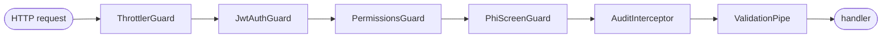
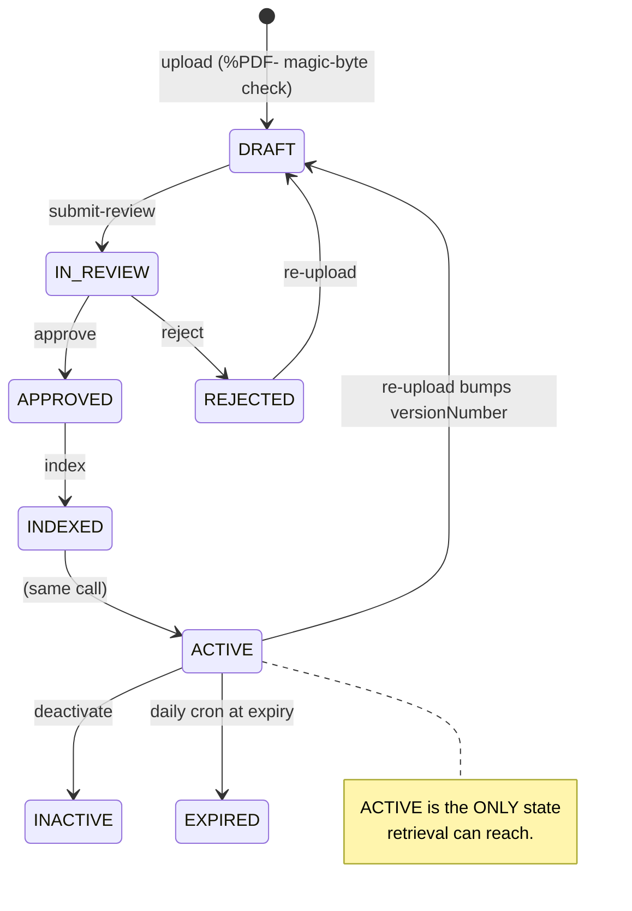

# 02 — Architecture

Only connections proven by code or configuration are drawn. Every box and edge
below has a file behind it, named beside it.

## System



Evidence per edge:

| Edge | File |
| --- | --- |
| web → API | `apps/web/src/lib/api.ts` — `API_URL` from `NEXT_PUBLIC_API_URL` |
| mobile → API | `apps/mobile/src/api.ts` — `EXPO_PUBLIC_API_URL`, overridable and cached in AsyncStorage |
| API → PostgreSQL | `TypeOrmModule.forRoot(buildDataSourceOptions())`, `app.module.ts:29`; raw SQL in `retrieval.service.ts`, `indexing.service.ts`, `analytics.module.ts` |
| API → object storage | `new S3Client({...})`, `storage.service.ts:30` |
| API → OpenAI-compatible | `openai-http.ts:53`; base `OPENAI_BASE_URL ?? https://api.openai.com/v1` |
| API → SMTP | dynamic `import('nodemailer')`, `mail.service.ts:55-56` |

**Not present, all searched:** message queue, WebSocket/realtime, webhook
receiver, cache layer, BFF, gateway, second backend. There is one process.

## The guard chain, and why its order is load-bearing



All four guards are global (`app.module.ts:55-63`), and the source comments say
why the order is what it is:

- **Throttler first**, so unauthenticated floods — login brute-force — are
  turned away at the edge before touching auth (`:53-54`).
- **PHI screen last among the guards**, and deliberately *after* authorization:
  the interception record needs an actor, and a caller who is not allowed on the
  route should be refused for that reason rather than told what the PHI screen
  makes of their payload (`:58-63`).
- **But still before the interceptor and the pipe**, which is the whole
  security property. Nest runs guards → interceptors → pipes → handler, so a
  request the PHI guard throws on never reaches `AuditInterceptor`. There is no
  `HTTP:POST:/chat/ask` row, no `ERROR:400` row, and no code path anywhere that
  could carry the rejected text into a store. A `class-validator` rule on the
  DTO would have run one stage later and could not make the same claim — nor
  could it screen `GET /rag/search?q=`, which has no DTO at all.

Authentication is **deny-by-default**: a route is public only if it carries
`@Public()`, and exactly seven do — five on `auth.controller.ts` and both health
routes. Verified by `grep -rn '@Public()' apps/api/src`.

## The refusal-first RAG chain

```mermaid
sequenceDiagram
  autonumber
  participant N as Nurse
  participant CH as ChatService
  participant RQ as RagQueryService
  participant RS as RetrievalService
  participant RR as RerankService
  participant L as LlmService
  participant DB as pgvector

  N->>CH: POST /chat/ask
  CH->>DB: INSERT ai_questions (verbatim)
  CH->>RQ: ask()
  RQ->>RQ: minScore = ragMinSimilarity() — re-read per call
  RQ->>RS: search()
  RS->>DB: ANN scan, LIMIT RAG_TOP_K,<br/>WHERE status='ACTIVE'<br/>AND not expired<br/>AND current version only<br/>AND current embedding provider
  alt no rows, or a dimension mismatch caught narrowly
    RQ-->>N: REFUSAL_MESSAGE_AR — NO_CANDIDATES
  end
  RS-->>RQ: candidates
  RQ->>RR: rerank() — promotion-only blend, then per-document cap
  alt nothing scores ≥ minScore
    RQ-->>N: REFUSAL_MESSAGE_AR — BELOW_THRESHOLD
  end
  RQ->>L: answer(question, top chunks)
  alt provider failed
    RQ-->>N: REFUSAL_MESSAGE_AR — MODEL_ERROR
  else empty output
    RQ-->>N: REFUSAL_MESSAGE_AR — MODEL_FOUND_NOTHING
  end
  L-->>RQ: {shortAnswer, steps, warnings} — no citation field
  RQ->>RQ: citations built from the SQL rows, never from the model
  CH->>DB: INSERT ai_answers + citations; audit AI:ANSWER
  RQ-->>N: answer + citations (document, page, approval date, confidence)
```

Four properties of that diagram are the product:

1. **Four refusal gates, one string.** All four route through a single
   `refusal()` helper returning `REFUSAL_MESSAGE_AR` verbatim with
   `ConfidenceLevel.NONE` and `citations: []`. `RagDiagnostics.refusedAt` names
   which gate fired — and those diagnostics reach only callers holding
   `analytics:read`, never a nurse.
2. **`MODEL_ERROR` is separated on purpose.** An outage must not masquerade as
   "the corpus does not cover this", which is why `src/eval/field-eval.ts`
   refuses to score it as governance.
3. **The threshold is re-read per call**, not cached, so the answer-quality
   harness can sweep it — and it is validated as a finite number in `[0, 1]`
   every time.
4. **A dimension mismatch refuses rather than 500s.** `RetrievalService.search()`
   catches pgvector's `different vector dimensions` *specifically* and returns
   no candidates, so the question routes through `NO_CANDIDATES` and the nurse
   gets the governed refusal. The catch is deliberately narrow — every other
   database failure still raises, because a refusal that hides a broken database
   is worse than an error.

## Document lifecycle



A `TRANSITIONS` map rejects illegal moves. Three notes that matter operationally:

- The `index` action performs INDEX **and** ACTIVATE in one call, so one click
  takes an approved document live.
- Re-uploading bumps `versionNumber` and resets status to DRAFT; the new version
  must be re-approved before the AI can cite it, and the *old* version's chunks
  stop matching the `c.version_number = d.version_number` filter immediately.
- A daily cron expires stale documents, removing them from retrieval at once,
  and alerts knowledge managers 30 days ahead.

## Why the embedding-provider filter exists

This is the least obvious of the four retrieval filters and the one three
separate documents dropped when summarising the query.

Vectors from different embedding providers occupy **incompatible spaces**. A
cosine distance computed across them is arithmetically valid and clinically
meaningless — it will return *something*, ranked, with a plausible score. So
every chunk is stamped with the provider that embedded it, and retrieval filters
on the active one.

The consequence is deliberate: switching `EMBEDDING_PROVIDER` makes the
assistant **refuse everything** — safe, and loud enough to notice — rather than
answer from junk similarity, until `POST /rag/reindex` re-embeds the corpus.

`providerCoverage()` then splits the mismatch two ways, and the split is the
difference between an actionable alarm and a permanent one:

| | Meaning | Can a reindex fix it? |
| --- | --- | --- |
| `staleRetrievable` | chunks from another provider on ACTIVE, unexpired, current-version documents | **yes** — and this is the number that should be zero |
| `staleOrphaned` | chunks on expired or superseded documents | **no** — `reindexAll()` is ACTIVE-only and never visits them; retrieval already excludes them for unrelated reasons |

Warning on the combined total meant one expired document produced an alarm no
action could ever clear.

## Where state lives

| Store | Holds | Client |
| --- | --- | --- |
| PostgreSQL 16 + pgvector | all application data **and** the vector index | TypeORM + raw SQL |
| S3-compatible object storage | the uploaded PDF bytes | `@aws-sdk/client-s3` |
| browser `localStorage` | web session, language (`bnp.lang`), theme | native |
| `expo-secure-store` | mobile access + refresh tokens | native module |
| `AsyncStorage` | mobile user profile + API-URL override | native module |

The mobile split is enforced by tests, not convention: the two storage modules
are mocked **separately** (`apps/mobile/test/mocks/`), which is what lets
`api.spec.ts` assert that tokens reach SecureStore and never AsyncStorage.
`api.ts` also performs a one-time migration deleting any pre-SecureStore
plaintext session from AsyncStorage.

The `embedding` column is **raw SQL, not TypeORM-managed**: inserts and queries
use parameterised SQL with a `[...]::vector` literal, because TypeORM has no
pgvector type.

## Two structural decisions worth understanding before changing anything

**The RBAC matrix is compiled, not stored.** `packages/shared/src/rbac.ts` holds
7 roles × 22 permissions; `JwtStrategy` derives a permission list from the JWT's
roles and `PermissionsGuard` compares it against `@Permissions(...)` metadata.
The guard **never reads the database**. The seeded `roles`, `permissions` and
`role_permissions` tables are a projection for the UI. Three consequences follow
and all three are deliberate: the roles API is read-only (`GET /roles` only,
because editing the projection would authorize nothing); a role that exists only
in the database grants nothing; and assigning *users* to roles is genuinely
enforced, because roles travel in the JWT.

**Chunk writes are serialised two ways, and both are needed.** `indexDocument`
takes `pg_advisory_xact_lock` on the document id inside its transaction, and
migration `1720000004000` adds `UNIQUE (document_id, version_number,
chunk_index)`. DELETE-then-INSERT under READ COMMITTED lets two concurrent index
calls each miss the other's uncommitted rows, so both chunk sets survive. The
constraint turns that silent duplication into an error; the lock is what makes
the concurrent case actually *succeed*. Verified by reverting each one
separately against a real database.

## Web architecture

Session in `localStorage`; `lib/api.ts` wraps fetch with refresh-on-401 then a
hard redirect to `/login`. Navigation is permission-filtered in
`components/shell.tsx` — items whose permission the session lacks are not
rendered, not merely styled.

**i18n is deliberately not next-intl and deliberately not locale-routed.**
Routes stay language-independent, so URLs, the browser smoke test's paths and
the Railway `/login` healthcheck are unaffected, and every route stays
statically prerendered — confirmed by the build output, where all 20 pages
report `○ (Static)`. Language persists under `bnp.lang` and is applied to
`<html lang|dir>` by an inline script **before first paint**, for a stronger
reason than the theme equivalent: a direction flip on hydration moves every
element on the page.

Two rules follow, and both have been violated and fixed in this repository:
use logical Tailwind classes (`start-*`/`end-*`, `ps-`/`pe-`) because physical
ones do not mirror; and put `dir="auto"` on anything rendered from API data,
because an assistant answer comes back in the language of the *question*, not of
the interface. A third, subtler one surfaced during this audit: a CSS
`transform` is a physical movement that `dir` does not mirror either, so a
drawer pinned at `start-0` and animated with a single `translateX(-100%)`
keyframe slid in from the wrong edge under Arabic.
