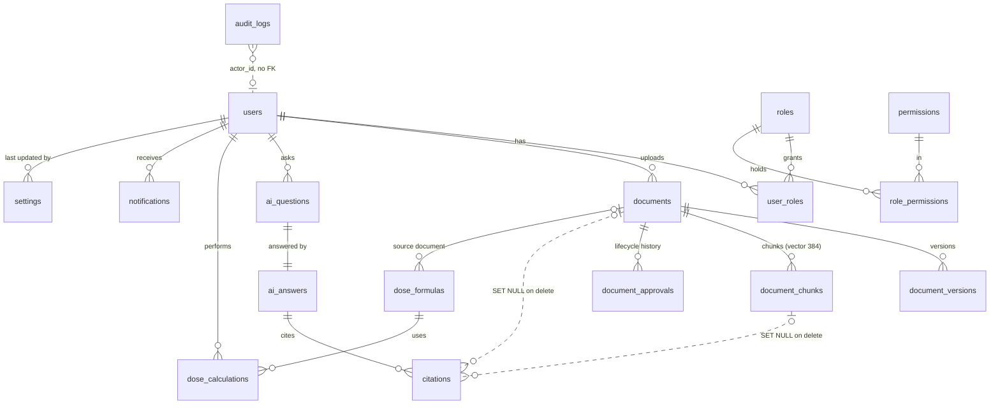

# 04 — Data model

Evidence: the five entity files under `apps/api/src/entities/` and the six migrations under
`apps/api/src/migrations/`, all read in full. `synchronize: false`
(`config/data-source.ts:41`) and migrations are registered explicitly, never by glob
(`config/data-source.ts:34-40`) — a migration file not listed there is silently ignored.

## Tables

**17 tables: 15 mapped entities plus 2 join tables.** The entity list is
`entities/index.ts:30-46`; the DDL is `1720000000000-initial-schema.ts:11-232`.

| Table | Entity | Notable columns |
| --- | --- | --- |
| `users` | `User` (`user.entity.ts:49`) | `email` UNIQUE, `password_hash`, `mfa_enabled`/`mfa_secret`, `token_version`, `failed_login_attempts`, `locked_until` |
| `roles` | `Role` (`user.entity.ts:26`) | `name` UNIQUE |
| `permissions` | `PermissionEntity` (`user.entity.ts:11`) | `code` UNIQUE |
| `role_permissions` | join (`user.entity.ts:37-43`) | PK `(role_id, permission_id)` |
| `user_roles` | join (`user.entity.ts:84-90`) | PK `(user_id, role_id)` |
| `documents` | `Document` (`document.entity.ts:13`) | `status`, `version_number`, `storage_key`, `issuing_authority`, `approval_date`, `expiry_date` |
| `document_versions` | `DocumentVersion` (`document.entity.ts:66`) | UNIQUE `(document_id, version_number)` |
| `document_chunks` | `DocumentChunk` (`document.entity.ts:104`) | `embedding vector(384)`, `embedding_provider`, `chunk_index`, `page_number` |
| `document_approvals` | `DocumentApproval` (`document.entity.ts:132`) | `action`, `from_status`, `to_status`, nullable `actor_id` |
| `ai_questions` | `AiQuestion` (`ai.entity.ts:110`) | `question text`, `assistant_type`, `channel` |
| `ai_answers` | `AiAnswer` (`ai.entity.ts:40`) | `short_answer`, `steps`/`warnings` jsonb, `refused`, `latency_ms`, `review_status` |
| `citations` | `Citation` (`ai.entity.ts:88`) | denormalised `document_title`, `page_number`, `approval_date`, `similarity`, `snippet` |
| `dose_formulas` | `DoseFormula` (`dose.entity.ts:19`) | `numeric(12,4)` dose fields, `status`, `source_document_id` |
| `dose_calculations` | `DoseCalculation` (`dose.entity.ts:82`) | `inputs` jsonb, `steps` jsonb, `final_dose_mg`, `warnings` jsonb |
| `audit_logs` | `AuditLog` (`misc.entity.ts:10`) | `actor_id`, `actor_email`, `action`, `metadata` jsonb, `ip`, `user_agent` |
| `notifications` | `Notification` (`misc.entity.ts:43`) | nullable `user_id` (broadcast), `is_read`, `metadata` |
| `settings` | `Setting` (`misc.entity.ts:70`) | `key` PK, `value` jsonb |

## Drift: none

Every mapped column reconciles to DDL. Two asymmetries exist and both are deliberate:

1. **`document_chunks.embedding vector(384)` is in SQL but not mapped** (`document.entity.ts:100-103`).
   It is written and queried only by parameterised raw SQL (`indexing.service.ts:250-264`,
   `retrieval.service.ts:60-79`).
2. **`AiAnswer.citations` is an eager `@OneToMany`** (`ai.entity.ts:80`) whose FK lives on the child
   table (`initial-schema.ts:150`) — normal ORM shape, not drift.

## Referential integrity, and where it is deliberately absent

| Relationship | On delete | Why it matters |
| --- | --- | --- |
| `document_versions.document_id` → `documents` | CASCADE | Versions are meaningless without the document |
| `document_chunks.document_id` → `documents` | CASCADE | Retrieval must not outlive the source |
| `ai_answers.question_id` → `ai_questions` | CASCADE | |
| `citations.answer_id` → `ai_answers` | CASCADE | |
| **`citations.document_id` → `documents`** | **SET NULL** | A historical answer keeps its denormalised title, page and snippet when the source is removed — the clinical record of *what a nurse was told* survives corpus changes |
| **`citations.chunk_id` → `document_chunks`** | **SET NULL** | Same, and it is what let migration `1720000004000` collapse duplicate chunks without destroying history (`1720000004000:24-27`) |
| `notifications.user_id` → `users` | CASCADE, nullable | Nullable is the broadcast case |
| **`audit_logs.actor_id`** | **no FK at all** (`initial-schema.ts:197`) | The audit trail is not bound to the users table, so removing a user cannot remove their audit history. `actor_email` is stored alongside for the same reason |

## Indexes

`idx_documents_status`, `idx_documents_category` (`:74-75`) · `idx_chunks_document` (`:102`) ·
**`idx_chunks_embedding` HNSW `vector_cosine_ops`** (`:103-105`) · `idx_audit_created` DESC,
`idx_audit_action` (`:209-210`) · `idx_chunks_embedding_provider` (`1720000003000:69-72`) ·
UNIQUE `uq_chunk_document_version_index` (`1720000004000:41-45`).

## Mermaid ERD

## Two findings for a reviewer, not defects

1. ~~**`documents` has no issuing-authority column.**~~ **Closed.** Migration `1720000005000`
   adds `documents.issuing_authority` and, deliberately, `citations.issuing_authority` as a
   snapshot — the record of what a nurse was told must survive later edits to the document, which
   is the same reason `citations.document_id` is `SET NULL` rather than `CASCADE`. A citation can
   now say "Hand Hygiene Policy, page 2, issued by the Nursing Department, approved 2026-03-01". The
   column is nullable with no backfill: every existing row genuinely has no recorded authority, and
   inferring one would be worse than the blank.
2. **`dose_calculations.inputs` stores patient attributes** — weight and age
   (`dose.service.ts:185-195`, column at `initial-schema.ts:187`). They are not identifiers, and the
   PHI screen does not cover them by design. Whether a clinical calculation log should retain them,
   and for how long, is a retention decision a clinician and a compliance officer make — not an
   engineering default. There is **no retention or purge policy anywhere in the schema or the code.**
